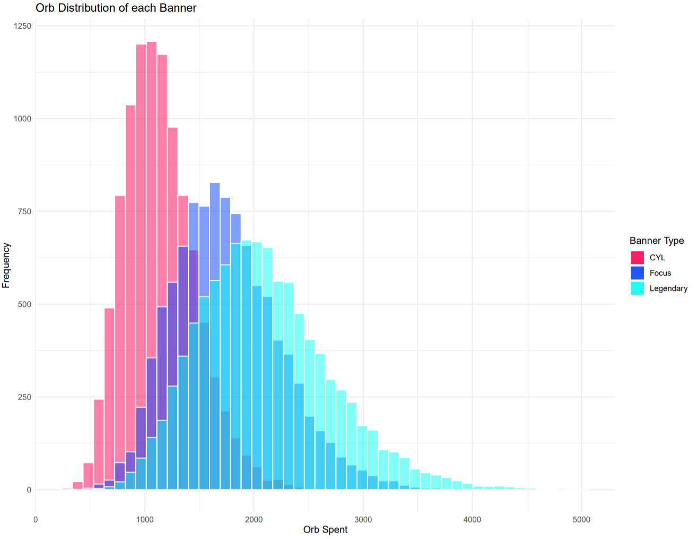

# Fire Emblem Heroes (FEH) Simulator

**Introduction**

For context, Fire Emblem Heroes (FEH) is a mobile free-to-play (F2P) game that utilizes the "loot-box" monetiziation strategy as its main source of revenue. Players can "summon" for a characters (at random) using in-game currency or with actual money. Each character has their own abilities and stats — some units are necessary to progress further or complete the in-game content or campaign.

So, who in the right mind would "summon" for a random characater? 

1. As of February 2019, the game has grossed $500 million worldwide, with Japan accounting for 56% (about $280 million) of its revenue (Wikipedia). 
2. Nintendo has crosssed over $1 billion in revenue from its mobile games for Android and IOS. Fire Emblem Heroes has since gone to over $656 million, more than every other Nintendo mobile game combined (The Verge).

So, yes, there are people (known as 'whales' in the gaming community) who like to take their chances and throw money at the game.
___

**Files**

Attached is an R script that runs the summoning simulation. In FEH, there are three popular summoning banners: Legendary, Focus, and Choose Your Legend (CYL). In the data folder, you will see simulation results for the three mentioned banners stored in a csv format. Each file contains 10,000 simulations. 

To modify the simluator, change the following variables:

1. **n** : Number of simulations to run.
2. **legendary_banner** : True or False (whether it is a Legendary Banner or not). 
3. **p_focus** : Probability of summoning for featured desired unit.
4. **p_non_focus** : Probability of summoning for non-featured unit and not desired, assuming Legendary Banner is False. 
5. **Focus_summon_rqt** : Number of desired copies to summon for. Default is at 11.

Simulations results will be stored into the dataframe variable **sim.df**. 
___

**Simulation Assumptions**

In each simulation, I assume the player's goal is 11 of the featured desired unit (1 base + 10 merges).

I also assume each color has equal probability in appearing in the summoning circle (which is slightly different from the actual summoning but results should be similar). 

___

**TLDR Simulation Results**

| Banner | Average Orbs Spent | US Dollars | St.Dev Orbs Spent |
| --- | --- | --- | --- |
| CYL | 1136 | ~$595 | 325 |
| Focus | 1749 | ~$917 | 491 |
| Legendary | 2095 | ~$1098 | 609 |

 

